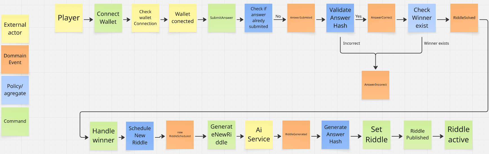

# OnchainRiddle - Development Journey

## The Beginning

When I started this project, I set up a Trello board to track my progress - even for a technical test, I wanted to work with the same methodology I use in real projects. To better understand the scope and outcomes, I conducted an event storming session. While it might seem overkill for a solo project, it helped me clearly define the key events and boundaries. I wanted to follow Domain-Driven Design (DDD) principles throughout.

### Event Storming Session

I created a comprehensive event storming diagram to map out the domain events, commands, and business rules. This visual representation helped me understand the flow between different actors (Player, Bot, AI Service) and the various states the system goes through.

The diagram shows two main flows:
1. **Player Riddle Submission Flow**: How players interact with the system to submit answers
2. **New Riddle Generation Flow**: The automated process of generating and publishing new riddles

This event storming exercise was crucial for implementing the clean architecture and ensuring all domain events were properly handled in the smart contract, backend, and frontend.

## My Development Philosophy

Even though this was a technical test, I put myself in "real development" conditions. Today, AI is a true accelerator in our field, and we need to use it as a tool. I'm not a fan of "vibe coding" yet - I prefer to maintain a structure that I can fully control on my projects.

For development, I still use two IDEs: Cursor and WebStorm. I find Cursor excellent for AI interactions, while WebStorm is still very useful for refactoring shortcuts and code navigation. I'm more comfortable with this hybrid approach for now, but we're getting close to being able to use either one exclusively.

## The Smart Contract Foundation

I started by setting up the smart contract part, which was already done. I used Hardhat for this and took the liberty of adding tests to the smart contract. After that, I moved on to the frontend.

## Frontend Development

I began by writing cursor files to guide the AI in my development. I like to work in small, simple steps following the KISS principle. The first objective was to be able to interact with the smart contract locally. Then I logically implemented the rest.

On my frontend, I only integrated with MetaMask wallet. I didn't spend too much time on the UX/UI (even though I have some knowledge, I felt that wasn't the main goal of this exercise).

## Backend Development

Once the frontend was fairly complete, I started the backend with the same mindset of following my event storming. Code architecture and naming are essential to me for good maintainability and onboarding (you'll tell me if I succeeded). I went with a classic clean architecture approach.

My first objective was to be able to send a new riddle manually. Then I implemented blockchain event listening, and finally found a solution to connect to an LLM via API.

## Development Process

Being alone on this project, I didn't create branches or pull requests for my development. I also notice that my commits are a bit "big" for easy understanding, but I attribute that to this being a setup project. On larger, more structured projects, I prefer to make smaller commits.

Whether on the frontend or backend, I maintain the habit of testing my business logic. But personally, I find that testing strategy depends a lot on the team you're working with. In my case, I preferred to test the core parts with a diamond testing strategy.

## Deployment Choice

To expose my application, I wanted a simple solution and chose Railway with turnkey CI/CD. This was my first time using this service, and I think it's very well done.

## Future Ideas

If we talk about functionality now, I have quite a few ideas for the application:

- Display scores by name or address
- Have multiple riddles
- Reset the riddle after a number of attempts
- Make each participation cost money (it's with this goal in mind that I didn't calculate the answer hash on the frontend, to revert in case of error)
- Reward system
- Add an Ownable smart contract to modify riddle management permissions

## What I Could Have Done to Improve

Examples of what I could have done to improve the app:
- Deploy a smart contract with a Proxy Upgrade Pattern (with OpenZeppelin for example) to be able to evolve the game
- Make wallet connection more fluid
- Create new events that the frontend can consume for new riddle availability

## Code Improvements

In my code, what I'd like to improve:
- The main part in the backend that I should split like an orchestrator
- Split the riddle game part in the frontend

But in both cases, I would have adapted these refactoring based on the future features that would be proposed to me (which I don't have for the moment).

## Key Learnings

This project reinforced my belief that structured development practices are valuable even in rapid prototyping. The combination of blockchain technology, AI integration, and modern web development creates interesting challenges and opportunities.

Using AI as a development accelerator rather than a replacement for fundamental software engineering practices proved to be the right approach. The event-driven architecture of blockchain works well with real-time updates, and clean architecture principles scale nicely across different layers.

## Conclusion

This technical test became a real learning experience in modern web3 development. The project successfully demonstrates how blockchain, AI, and traditional web development can work together to create engaging applications. While there's always room for improvement, the foundation is solid and ready for future enhancements.

I'm looking forward to discussing all of this with you in person!